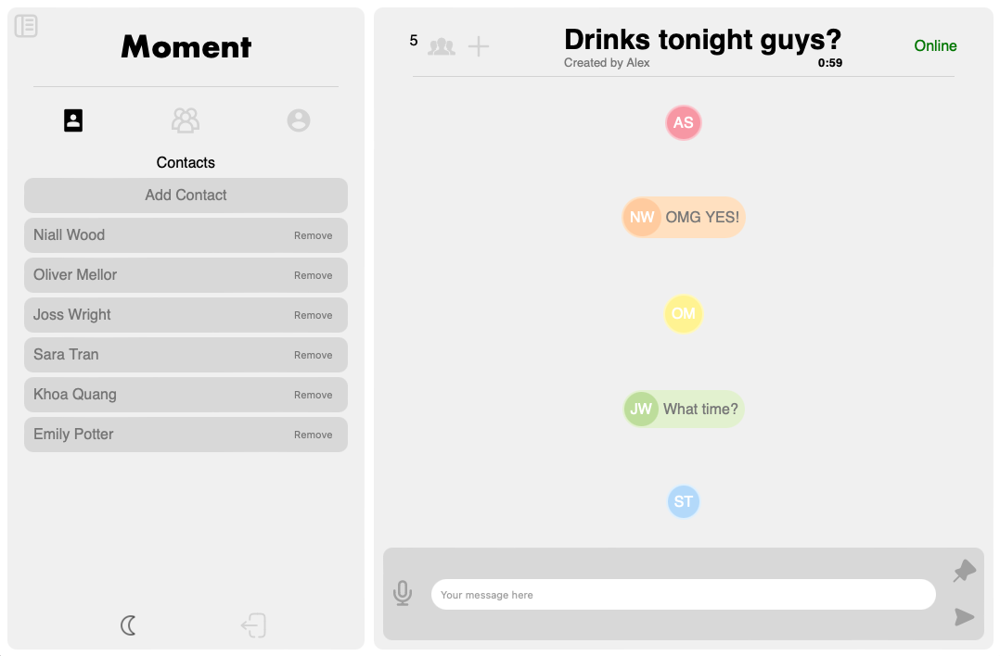

# Moment

---

## About this project

This is project was set by the Odin Project as the second of 3 final full stack projects designed to showcase everything that's been taught in the full course. 

The course set an assignment to build a basic messaging app (without real-time messages).  However, I took it upon myself to take it a step further and build a group orientated messaging app that solves the problem of missing the moment.  This app allows users to talk in the moment as if they are in the same room. 

The first message sets the name of the room along with a 1 minute timer. People who are engaged in the room will see messages for a brief moment (depending on how long the message is). After 1 minute of inactivity, the room is closed and any pinned message is pushed to all users.

---

## Technologies

JS
CSS
React
NodeJS
MongoDB
Socket IO

---

## Screenshots

### Picture 1

### Picture 2

### Picture 3

### Picture 4

### Picture 5

### Picture 6

